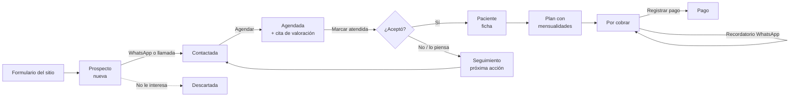

# Manual del panel del consultorio

El panel vive en `/admin` y está pensado para usarse **desde el celular**. Aquí están cada sección explicada, sus diagramas y el video de cómo se usa.

| Sección | Para qué sirve | Quién la ve |
|---|---|---|
| [Acceso y roles](acceso-y-roles.md) | Entrar, salir, instalar la app en el teléfono | Todas |
| [Inicio](inicio.md) | Qué hay que hacer hoy y cómo va la captación | Todas (el dinero solo la doctora) |
| [Prospectos](prospectos.md) | Personas que pidieron valoración: contactarlas y darles seguimiento | Todas |
| [Agenda](agenda.md) | Citas por día y por semana, asistencia y conversión | Todas |
| [Pacientes](pacientes.md) | Fichas, plan de tratamiento y mensualidades | Doctora |
| [Pagos](pagos.md) | Por cobrar, recordatorios por WhatsApp y registro de pagos | Doctora |
| [Google Calendar](google.md) | Copiar las citas al calendario de Google | Doctora |

Para quien mantiene el sistema:

- [Arquitectura](arquitectura.md): cómo viaja una petición desde el teléfono hasta la base.
- [Modelo de datos](modelo-datos.md): tablas, relaciones y estados.
- [Hallazgos de la auditoría móvil](hallazgos.md): errores y mejoras encontrados, por prioridad.
- [Documentación UML completa](../uml/README.md): requisitos, casos de uso, componentes, despliegue, clases, actividad, estados, secuencia, trazabilidad y decisiones. También en el [tablero de FigJam](https://www.figma.com/board/1G5l7tKjzITEo8OgkuzwWG).

## El recorrido completo, en un diagrama

## Videos

Cada sección tiene un video grabado en el panel real a tamaño de celular (390 × 844), con datos inventados:

| # | Video | Qué enseña |
|---|---|---|
| 01 | `videos/01-acceso.mp4` | Entrar, instalar en el teléfono, salir |
| 02 | `videos/02-inicio.mp4` | La cola de «Hoy» y las métricas |
| 03 | `videos/03-prospectos.mp4` | Lista, filtros, ficha, contacto y seguimiento |
| 04 | `videos/04-agenda.mp4` | Agendar, reprogramar y marcar asistencia |
| 05 | `videos/05-convertir.mp4` | De valoración atendida a paciente |
| 06 | `videos/06-pacientes.mp4` | Alta, ficha, plan y agendar control |
| 07 | `videos/07-pagos.mp4` | Recordar un cobro y registrar el pago |
| 08 | `videos/08-google.mp4` | Pantalla de conexión con Google Calendar |

Los videos se generan con `pnpm manual` seguido de `node scripts/videos-manual.mjs` y no se versionan en git.
