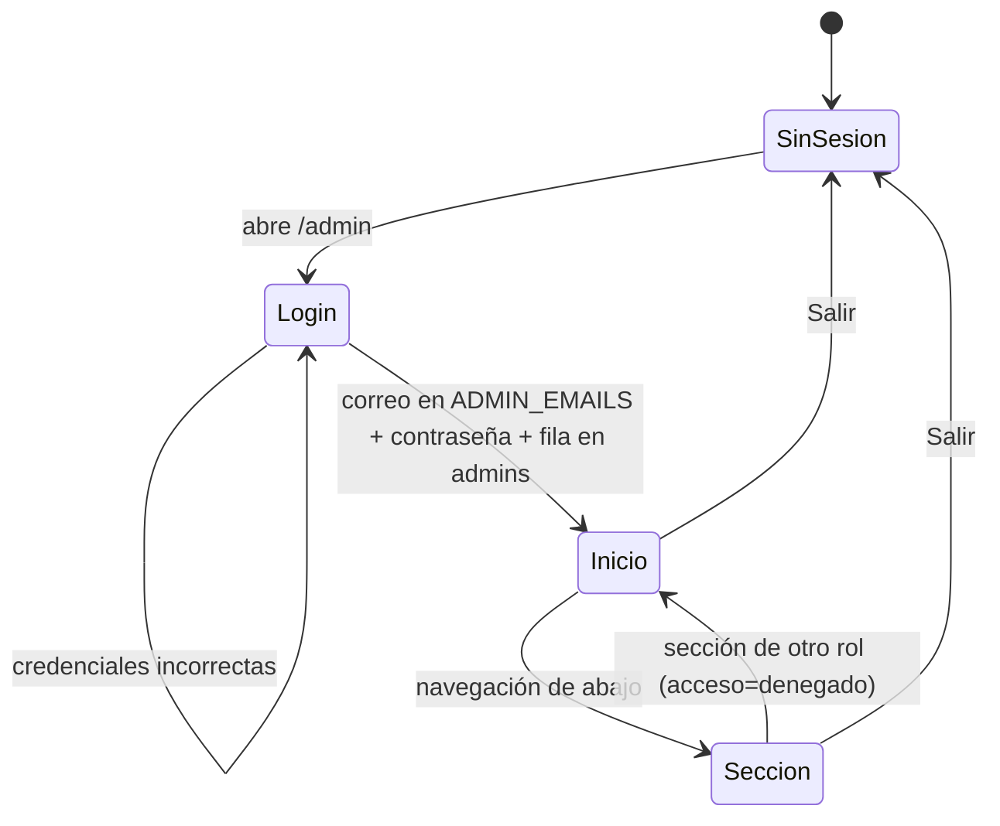

# Acceso y roles

> Video: `videos/01-acceso.mp4`

## Entrar

1. Abre **`/admin`** en el teléfono. Si no hay sesión, aparece «Panel de solicitudes».
2. Escribe tu **correo** y tu **contraseña** y toca **Entrar**.
3. Llegas a **Inicio**.

Si el correo o la contraseña no coinciden, el mensaje es el mismo en los dos casos a propósito: así nadie puede averiguar qué cuentas existen. **No hay «olvidé mi contraseña»**: se repone desde el script `pnpm admin` (ver `e2e/README.md`).

## Instalar en el teléfono

- **iPhone (Safari):** botón Compartir → «Añadir a pantalla de inicio». Queda como «Panel BP».
- **Android (Chrome):** menú ⋮ → «Instalar app».

Se abre a pantalla completa. Sin conexión aparece una pantalla que lo dice, en vez de un error del navegador.

## Salir

Botón **Salir** arriba a la derecha, en cualquier pantalla.

## Roles

| | Doctora | Recepcionista |
|---|---|---|
| Inicio (cola y captación) | ✔ con cobranza y dinero | ✔ sin dinero |
| Prospectos: contactar, seguimiento, notas, estado | ✔ | ✔ |
| Convertir en paciente | ✔ | ✘ |
| Agenda: crear, reprogramar, asistencia | ✔ | ✔ |
| Pacientes y planes | ✔ | ✘ |
| Pagos y recordatorios de cobro | ✔ | ✘ |
| Google Calendar | ✔ | ✘ |

La navegación de abajo solo enseña las secciones del rol. Si la recepcionista abre una URL de la doctora, vuelve a Inicio con el aviso «Esa sección es solo de la doctora».



## Dar de alta una cuenta

```bash
pnpm admin alta <correo> --rol=doctora        # o --rol=recepcionista
```

Después hay que añadir el correo a `ADMIN_EMAILS` en `.env` **y** en Vercel, y volver a desplegar. Sin las dos cosas, la cuenta no entra.
