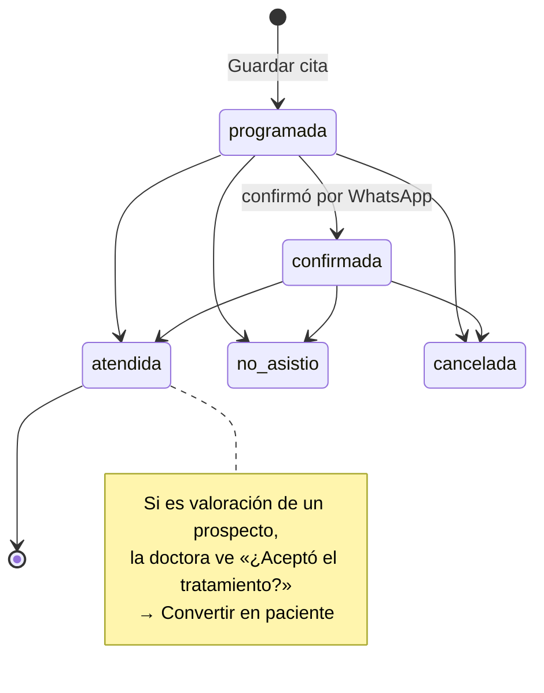
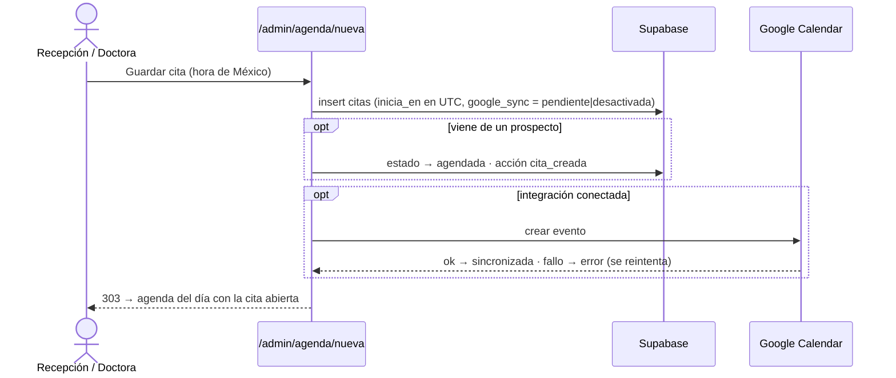

# Agenda

> Video: `videos/04-agenda.mp4`

Citas de **valoración** (prospectos) y de **control** (pacientes), en una rejilla por horas de **9:00 a 19:00**, y el sábado de **9:00 a 13:00**.

## Vistas

- **Día**: rejilla vertical. En el teléfono, arriba va un selector con los días de la semana y cuántas citas tiene cada uno.
- **Semana**: lunes a sábado. Las citas del domingo y las que quedan fuera de horario van a la lista **Fuera de horario**: nunca se esconden.
- Flechas para día o semana anterior y siguiente, y **Hoy** para volver.
- Filtros por estado y **Solo las mías** (las que tienen a esa persona como responsable).

Cada bloque mide lo que dura la cita y su color depende del tipo: **arcilla** para valoración y **teal** para control. Las canceladas y las de «no asistió» se ven atenuadas. Al tocar un bloque se abre el detalle **sin salir de la agenda**.

## Estados de una cita

Cancelar **no borra**: la cita queda marcada, sigue en la agenda y se apunta en el historial del prospecto.

## Nueva cita

1. **Nueva cita** desde la agenda, Inicio, la ficha de un prospecto (**Agendar cita**) o la de un paciente (**+ Agendar**). Desde una ficha, nombre y teléfono ya vienen puestos.
2. **¿Quién viene?** Nombre y teléfono.
3. **¿Cuándo?** Fecha y hora, tipo y duración (atajos de 15, 30, 45, 60 y 90 min). La franja del día enseña lo que ya está ocupado.
4. **Nota para la agenda** (opcional).
5. **Guardar cita** lleva al día de la cita con el detalle abierto.

Si la cita es de un prospecto *Nueva* o *Contactada*, el prospecto pasa a **Agendada** y queda «Cita creada» en su historial.

## Editar una cita

**Editar** (desde el detalle) abre `/admin/agenda/<id>`. Ahí se puede:

- **Cuándo**: fecha y hora, duración, tipo, nombre, teléfono y nota → **Guardar cambios**. Si cambia la hora, queda «Cita reprogramada» en el historial.
- **Contacto**: llamar o escribir por WhatsApp.
- **Asistencia**: Programada, Confirmada, Atendida, No asistió o Cancelada → **Guardar asistencia**.
- **¿Aceptó el tratamiento?** (valoración atendida, doctora): **Convertir en paciente**.

## Google Calendar

Si está conectado, cada cambio se copia al calendario elegido. El botón **Google · N sin sincronizar** y **Reintentar** recogen las que fallaron. Ver [google.md](google.md).
