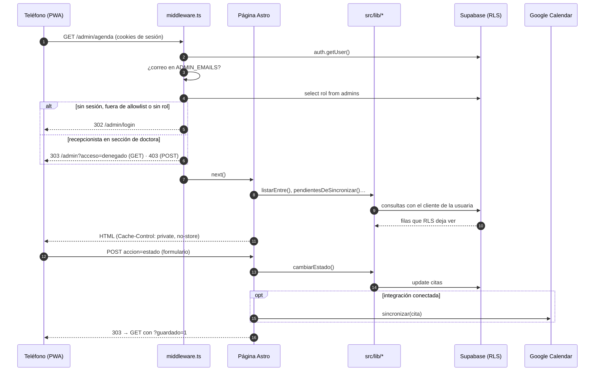
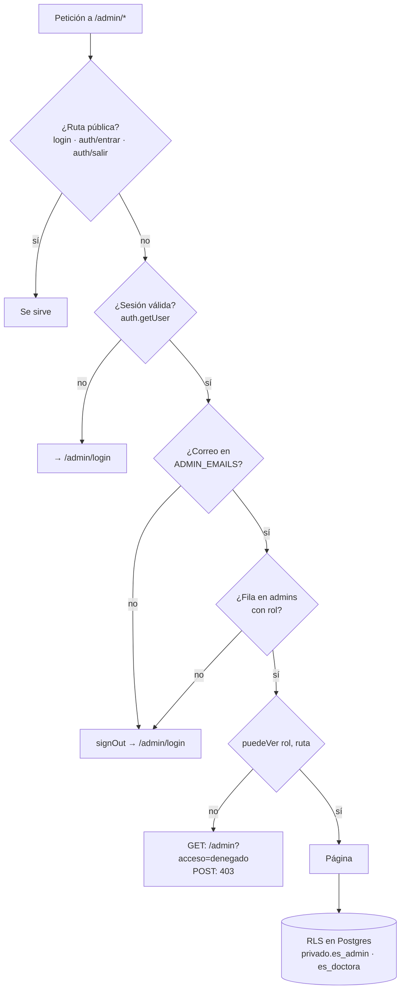

# Arquitectura del panel

Astro 7 con renderizado en servidor (Vercel), Supabase (Auth + Postgres con RLS) y Google Calendar como espejo opcional de la agenda. No hay API JSON propia: cada pantalla es una página Astro que lee en el servidor y escribe con formularios `POST` → redirect `303` → `GET`.

## Petición típica

## Tres barreras de acceso

- **ADMIN_EMAILS** (variable de entorno) decide quién puede intentar entrar.
- **`admins.rol`** decide qué secciones existen (`src/lib/roles.ts`, `src/lib/panel.ts`).
- **RLS** es la barrera real: la recepcionista recibe cero filas de pacientes, planes, cuotas, pagos y recordatorios aunque llegue a la URL.

## Piezas por carpeta

| Carpeta | Qué contiene |
|---|---|
| `src/middleware.ts` | Sesión, allowlist, rol, cabeceras `no-store` y `noindex` |
| `src/layouts/AdminLayout.astro` | Barra superior, navegación, guarda contra doble envío, registro del service worker |
| `src/components/admin/` | `NavPanel` (lateral ≥ 940 px, raíl 720–939, pestañas abajo < 720), `AvisoContactado`, `CamposPaciente`, `Icono` |
| `src/lib/solicitudes.ts`, `seguimiento.ts` | Prospectos, estados, próxima acción e historial |
| `src/lib/citas.ts`, `horario.ts`, `tiempo.ts` | Agenda, rejilla 9–19 (sábado 9–13) y conversión México ↔ UTC |
| `src/lib/pacientes.ts`, `pagos.ts`, `cobranza.ts` | Fichas, planes, cuotas, pagos y recordatorios |
| `src/lib/metricas.ts`, `panel.ts` | Embudo e indicadores de Inicio |
| `src/lib/google/*` | OAuth, tokens cifrados y sincronización con reintento |
| `public/panel-sw.js`, `panel.webmanifest` | App instalable y pantalla sin conexión |

## Zona horaria

Toda hora se **teclea y se muestra en hora de Ciudad de México** y se **guarda en UTC** (`deMexicoAIso`, `partesEnMexico`, `diaEnMexico` en `src/lib/tiempo.ts`). Vercel corre en UTC, así que cualquier `new Date()` sin zona o cualquier `.slice(0, 10)` sobre un ISO es sospechoso. Ver hallazgos H-03 y H-12.
