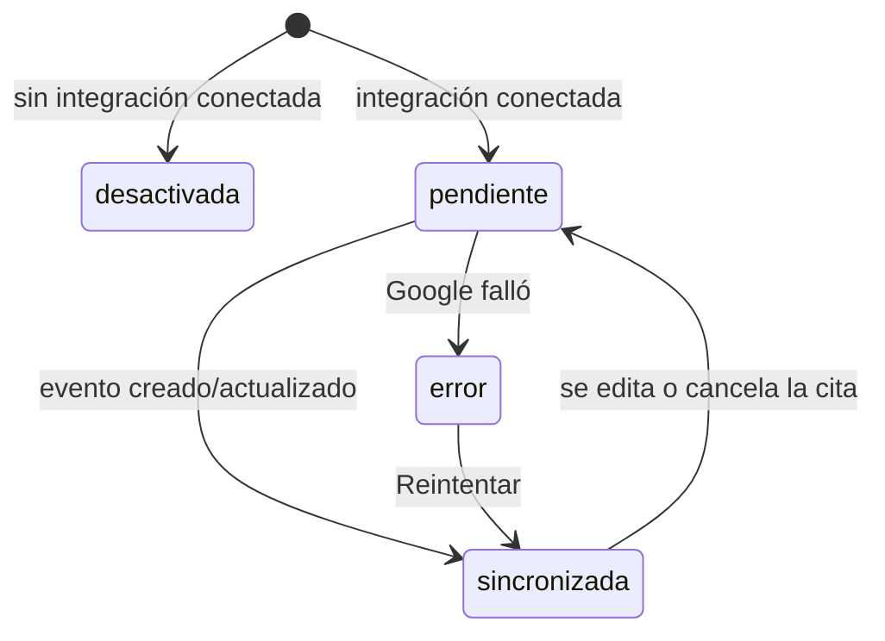
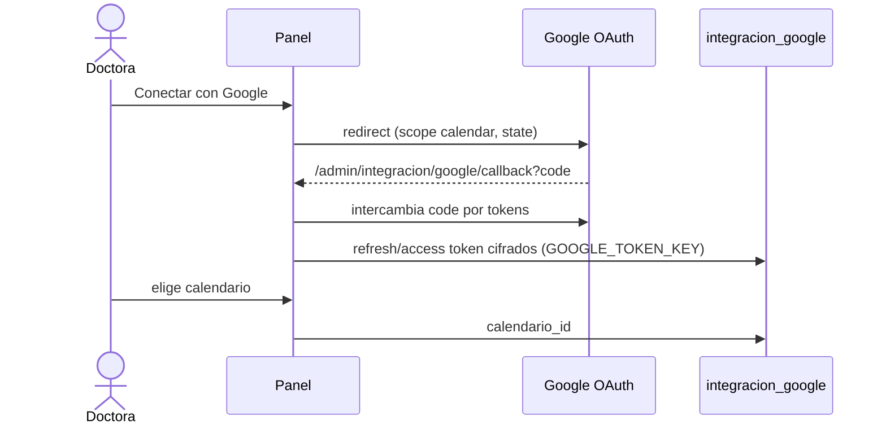

# Google Calendar

> Video: `videos/08-google.mp4` · Solo la doctora

Copia cada cita del panel a un calendario de Google, para verla en el teléfono junto al resto de su agenda. **El panel es la fuente de verdad**: Google es un espejo, y si falla, la cita sigue guardada.

## Conectar (una sola vez, lo hace la doctora)

1. Agenda → **Google Calendar** → **Conectar con Google**.
2. Elige su cuenta y acepta el permiso de calendario.
3. En **Calendario destino**, elige a dónde van las citas y toca **Guardar calendario**. Solo aparecen los calendarios en los que esa cuenta puede escribir.

## Estados de sincronización de una cita

Qué se copia: tipo de cita, nombre, hora, duración y teléfono. **La nota de la agenda no viaja**, porque el calendario lo ve todo el consultorio, y nada de pagos. Si hay citas que no llegaron a Google, **Reintentar ahora** las vuelve a mandar.
