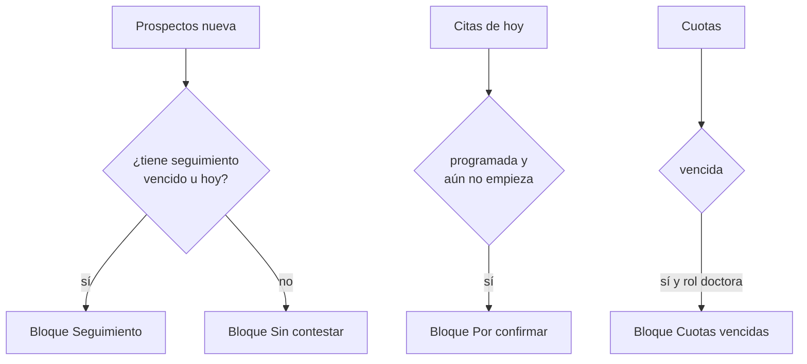

# Inicio

> Video: `videos/02-inicio.mp4`

Lo primero que se ve al entrar. Responde dos preguntas: **¿qué tengo que hacer hoy?** y **¿cómo va la captación?**

## Cabecera

Saludo según la hora de México, la fecha y cuántas citas hay hoy. Los botones rápidos son **Nueva cita** y, para la doctora, **Registrar pago**.

## «Hoy»: la cola de trabajo

Aparecen hasta **6 elementos por bloque**, y cada persona sale **una sola vez**:

| Bloque | Qué entra | Acción de un toque |
|---|---|---|
| **Sin contestar** | Prospectos en estado *Nueva* | **Contactar**: abre WhatsApp con el mensaje escrito |
| **Seguimiento** | Próximas acciones vencidas o de hoy (en rojo si ya pasaron) | **Hecho**: cierra la acción y la anota en el historial |
| **Por confirmar** | Citas de hoy *programadas* que aún no empiezan | **Confirmar**: WhatsApp con fecha y hora |
| **Cuotas vencidas** (doctora) | Mensualidades vencidas y si ya se recordaron | **Cobrar**: WhatsApp con el monto |

Si una persona tiene prospecto sin contestar **y** seguimiento, gana el seguimiento.

Al volver de WhatsApp aparece un aviso para marcar al prospecto como **Contactada** con un toque. Es lo que alimenta la métrica «Contactadas».

## Agenda de hoy

Línea de tiempo con las citas del día (sin las canceladas), la marca **AHORA** entre las pasadas y las que vienen, y un chip con el estado de Google.

## Cómo va la captación

Periodo de **7 días, 30 días, este mes o 90 días**.

- **Embudo:** Solicitudes → Contactadas → Agendadas → Convertidas, con el porcentaje de cada paso sobre las solicitudes.
- **Indicadores:** citas atendidas y cuántas no asistieron. La doctora ve además lo **cobrado** en el periodo y lo **vencido hoy**. La recepcionista ve la **conversión**.

> Ojo al leer el embudo: cada número cuenta lo que **pasó en el periodo** y no sigue a las mismas personas. Un paciente dado de alta directo cuenta como «convertido» aunque no viniera de una solicitud. Ver hallazgo H-06.
