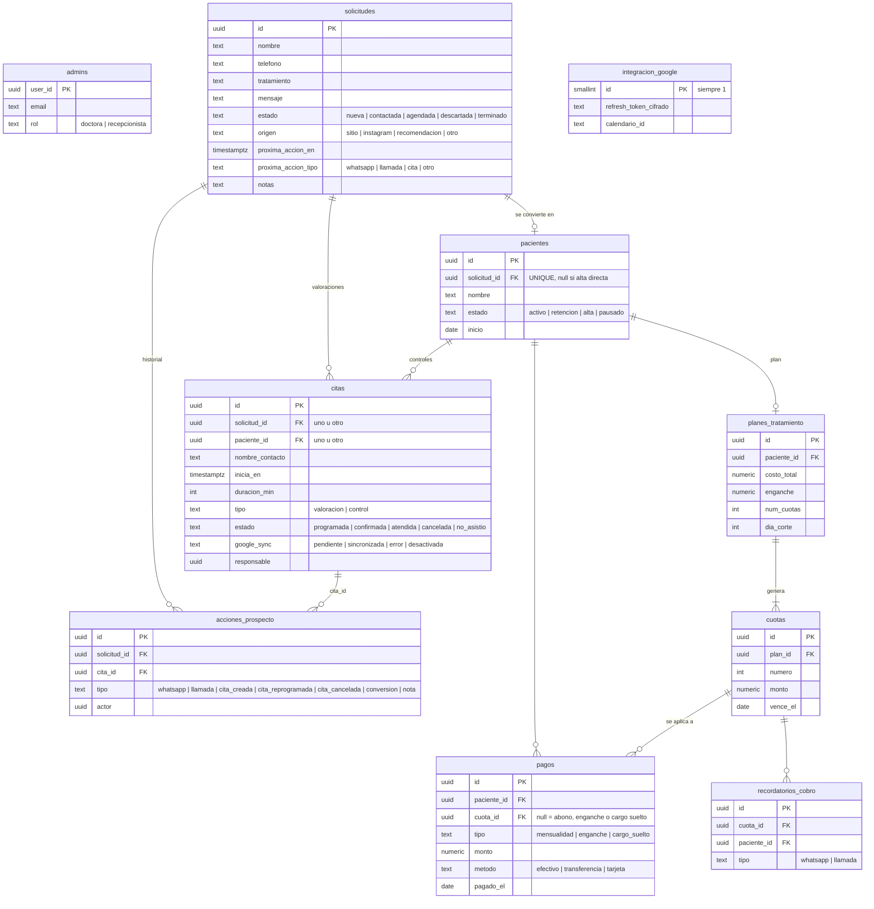

# Modelo de datos

Supabase Postgres, proyecto `wffqduqgnknopjrwyjpe`. Migraciones en `supabase/migrations/` (la tabla `solicitudes` es anterior a ellas).

## Vistas

- **`vista_cuotas`**: cada cuota con `pagado`, `restante` y `estado` calculado. Precedencia: `pagada` › `vencida` (`vence_el < current_date`) › `parcial` › `pendiente`.
- **`vista_saldo_paciente`**: costo total, pagado, saldo, cuotas vencidas, monto vencido y próxima fecha.

El estado de una cuota **no se guarda**: se deriva de la fecha y de los pagos, así que no hay nada que «actualizar» cuando pasa el día de corte.

## Quién puede qué (RLS)

| Tabla | Doctora | Recepcionista |
|---|---|---|
| solicitudes, acciones_prospecto, citas | leer y escribir | leer y escribir |
| pacientes, planes, cuotas, pagos, recordatorios | leer y escribir | **nada** |
| integracion_google | solo por servidor (clave secreta) | nada |
| admins | su propia fila | su propia fila |
