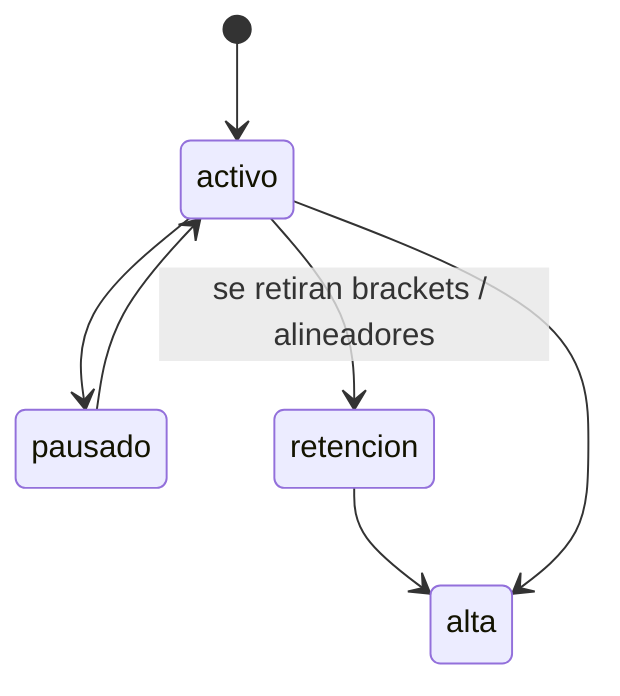
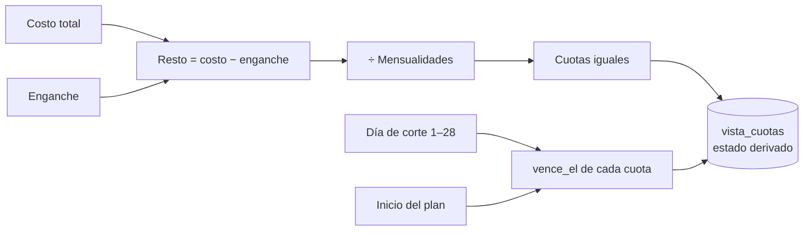
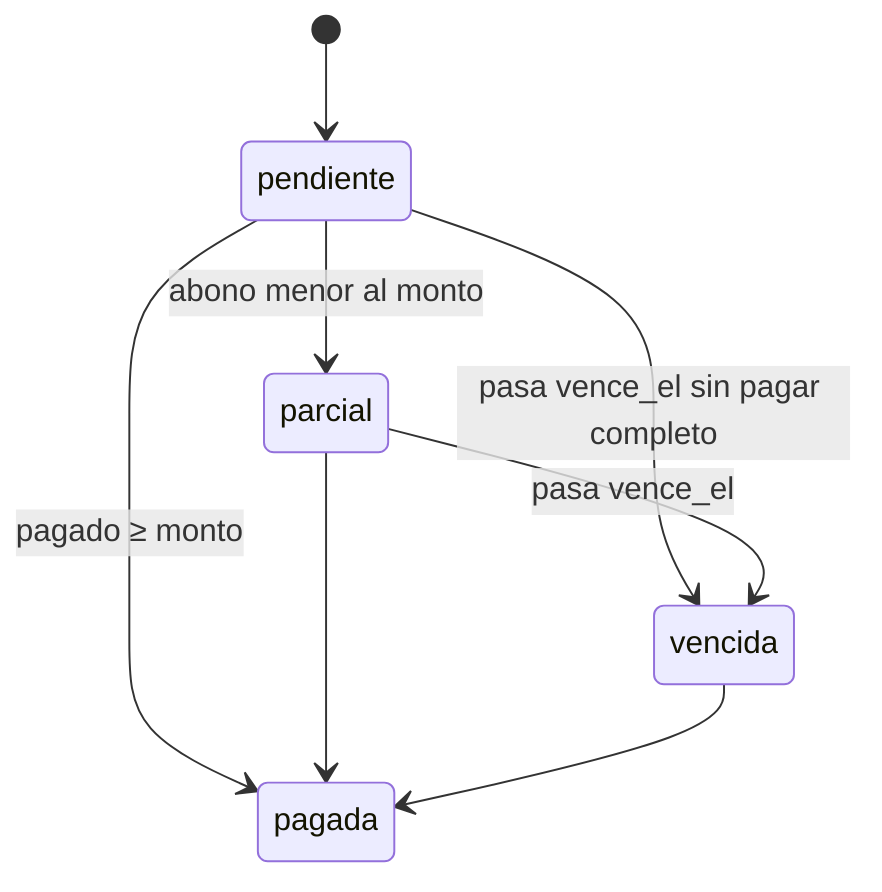

# Pacientes

> Video: `videos/06-pacientes.mp4` · Solo la doctora

## Lista

Buscar por nombre o teléfono y filtrar por estado del tratamiento. Cada paciente enseña su saldo, las cuotas vencidas y dos accesos: **Crear plan** (si no tiene) y **+ Agendar**.

**Nuevo paciente** da de alta sin pasar por un prospecto. Se usa para quien llegó por teléfono o ya era paciente.

## Estados del tratamiento

## Ficha

| Bloque | Qué enseña |
|---|---|
| Cabecera | Nombre, estado, tratamiento, de qué solicitud vino. **WhatsApp**, **Llamar**, **Agendar** y **Registrar pago** |
| Resumen | Costo total, pagado, saldo, progreso de mensualidades y **Editar plan** |
| Mensualidades | Lo vencido o parcial más las 4 siguientes. En las vencidas o parciales: **Cobrar** (WhatsApp) y **Marcar enviado**. En la siguiente por vencer: **Registrar**. El resto va plegado |
| Historial de pagos | Fecha, concepto, método y monto |
| Citas | La próxima destacada y las anteriores |
| Datos | Teléfono, inicio, origen. **Editar datos** y **Notas** plegables |

## Plan de tratamiento

Campos: tratamiento, costo total, enganche, número de mensualidades, día de corte (1–28) e inicio. **Guardar plan** genera las cuotas con el RPC `crear_plan_con_cuotas`.

Estado de cada cuota (se calcula solo):

