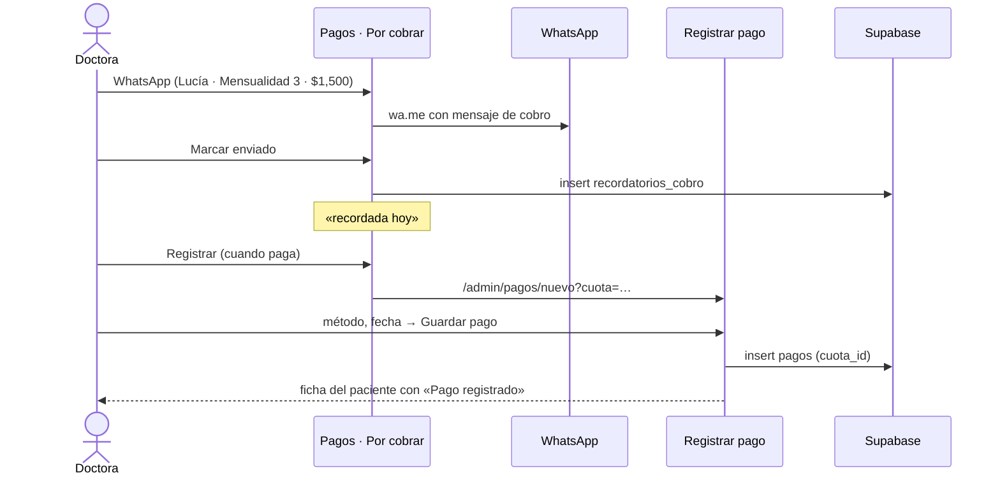

# Pagos

> Video: `videos/07-pagos.mp4` · Solo la doctora

## Pantalla de pagos

- **Periodo**: selector de mes (los últimos 12).
- **Resumen**: cobrado en el mes contra lo esperado, monto vencido, cuántos pacientes deben y cuántos siguen sin recordatorio.
- **Por cobrar**: cuotas vencidas y las que vencen pronto (45 días). Filtro **Solo vencidas**. En cada fila:
  - **WhatsApp**: abre la conversación con el mensaje de cobro ya escrito (nombre, número de mensualidad, monto y fecha).
  - **Marcar enviado**: apunta que se recordó. La fila dice «recordada hace N días».
  - **Registrar**: abre el formulario de pago con esa cuota elegida.
- **Movimientos**: pagos del mes, con filtro por tipo y opción **Quitar** con confirmación.

## Cobrar una mensualidad vencida

El panel **no envía mensajes por su cuenta**: los manda la doctora desde su teléfono y el panel solo lleva la cuenta.

## Registrar pago

1. **Paciente** (cambiarlo recarga para traer sus mensualidades).
2. **¿A qué corresponde?** Una mensualidad concreta, un abono al plan, el enganche o un cargo suelto (retenedor, radiografía…).
3. **Monto**: se rellena con lo que falta de la mensualidad elegida. Puede ser menor, y entonces la cuota queda *Parcial*.
4. **Método** (efectivo, transferencia, tarjeta) y **fecha**.
5. **Concepto** y **nota** (referencia de la transferencia).
6. El lateral enseña el **saldo después de este pago**. **Guardar pago**.
