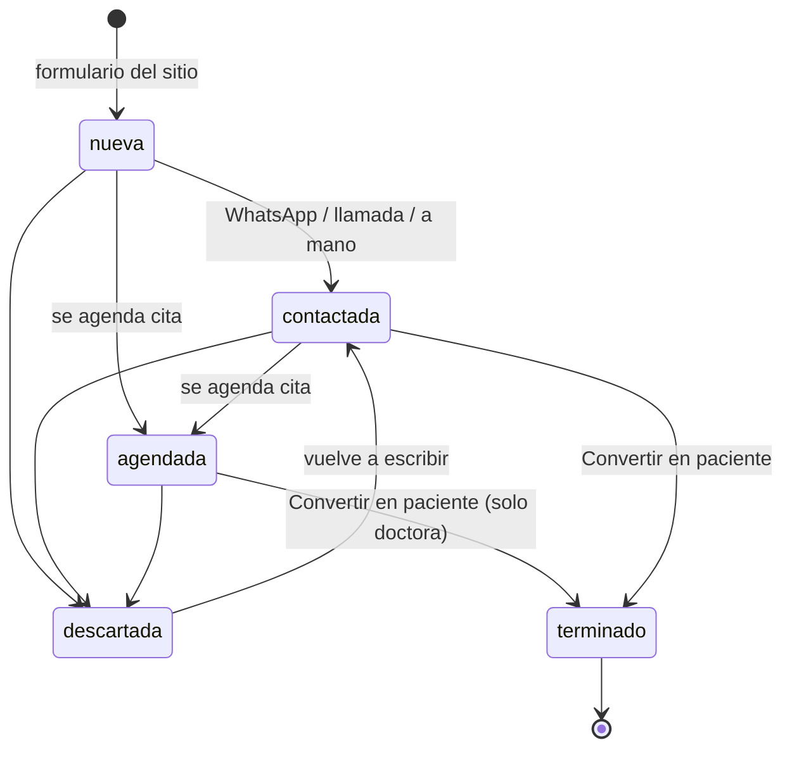
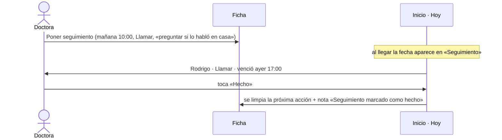

# Prospectos

> Video: `videos/03-prospectos.mp4`

Cada persona que llena el formulario del sitio llega aquí como **Nueva**. En esta sección se le contacta, se le da seguimiento y, cuando acepta, se le convierte en paciente.

## Estados

`terminado` **no se elige a mano**: solo lo pone «Convertir en paciente», que además crea la ficha.

## Lista

- **Buscar** por nombre o teléfono.
- **Chips de estado** con su número: Todas, Nuevas, Contactadas, Agendadas, Descartadas, Terminadas.
- **Seguimiento vencido**: solo los prospectos cuya próxima acción ya pasó.
- **Origen**: sitio web, Instagram, recomendación u otro.
- Cada tarjeta enseña teléfono, tratamiento, origen, próxima acción (en rojo si venció), fecha y un **selector de estado** que guarda al soltarlo.
- Botón **WhatsApp**: abre la conversación con un mensaje ya escrito.

## Ficha del prospecto

| Bloque | Qué hace |
|---|---|
| Cabecera | Estado, origen, tratamiento. Botones **WhatsApp**, **Llamar**, **Anotar llamada** y **Agendar cita** |
| Mensaje | Lo que escribió, su teléfono y cuándo aceptó el aviso de privacidad |
| Historial | Línea de tiempo: contactos, citas (con su estado), conversión, notas |
| Próxima acción | Qué toca y cuándo. **Marcar como hecho** o **Cambiar el seguimiento** (fecha, tipo y nota corta) |
| Situación | Cambiar el estado a mano |
| Convertir en paciente | Solo la doctora. Abre un formulario precargado |
| Origen | Plegable. Por dónde llegó |
| Notas | Privadas, el prospecto no las ve |

### Seguimiento

Si se cambia el estado y había un seguimiento pendiente, **no se borra solo**: aparece un aviso con **Quitar seguimiento**.

## Convertir en paciente

1. Desde la ficha (o desde una cita de valoración marcada **Atendida**), toca **Convertir en paciente**.
2. Revisa nombre, teléfono, tratamiento, fecha de inicio y estado del tratamiento.
3. **Crear paciente** lleva a la ficha nueva. El prospecto queda en *Terminado* y su seguimiento se cierra.

> Video: `videos/05-convertir.mp4`
