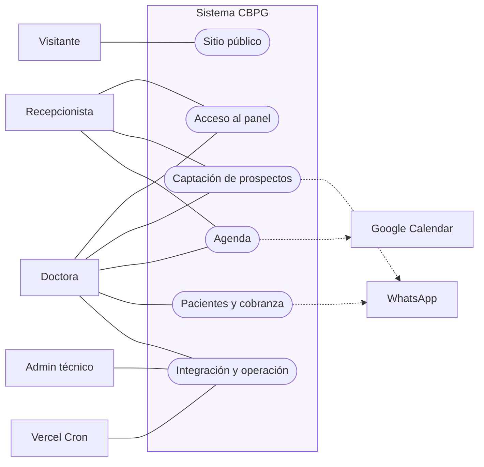
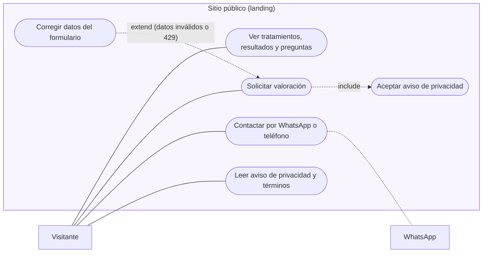
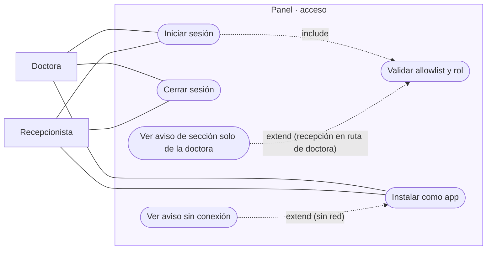
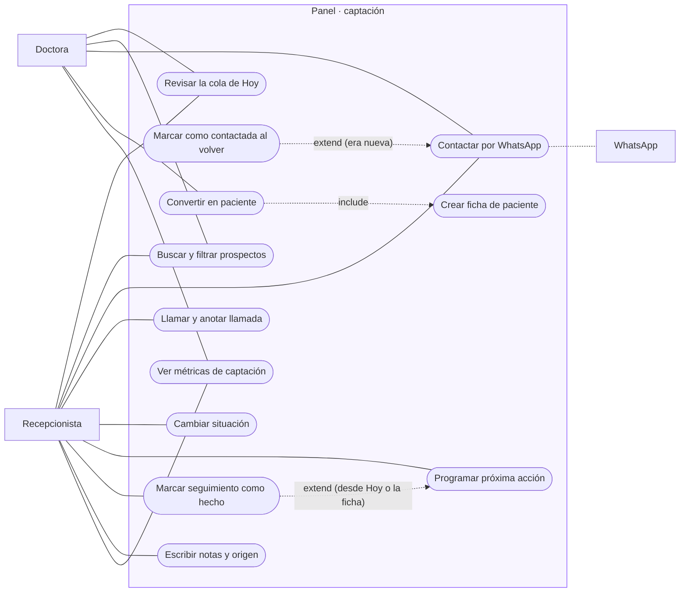
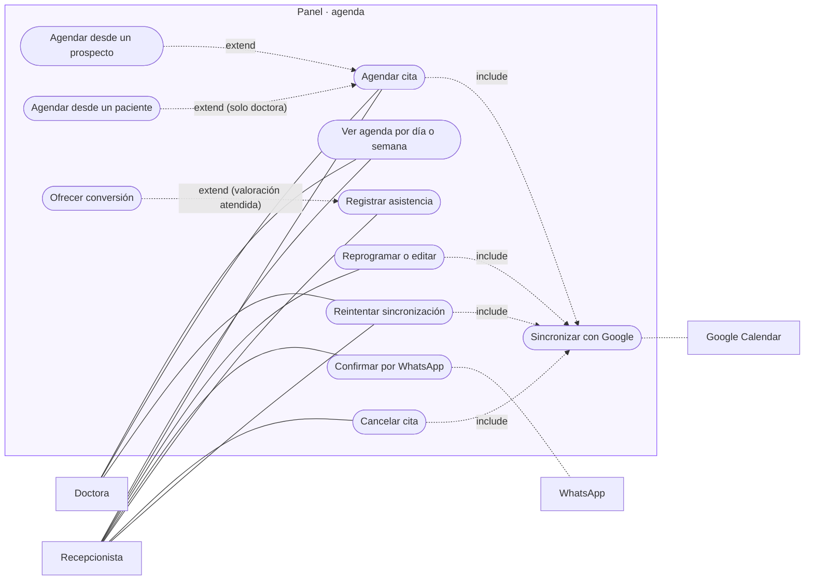
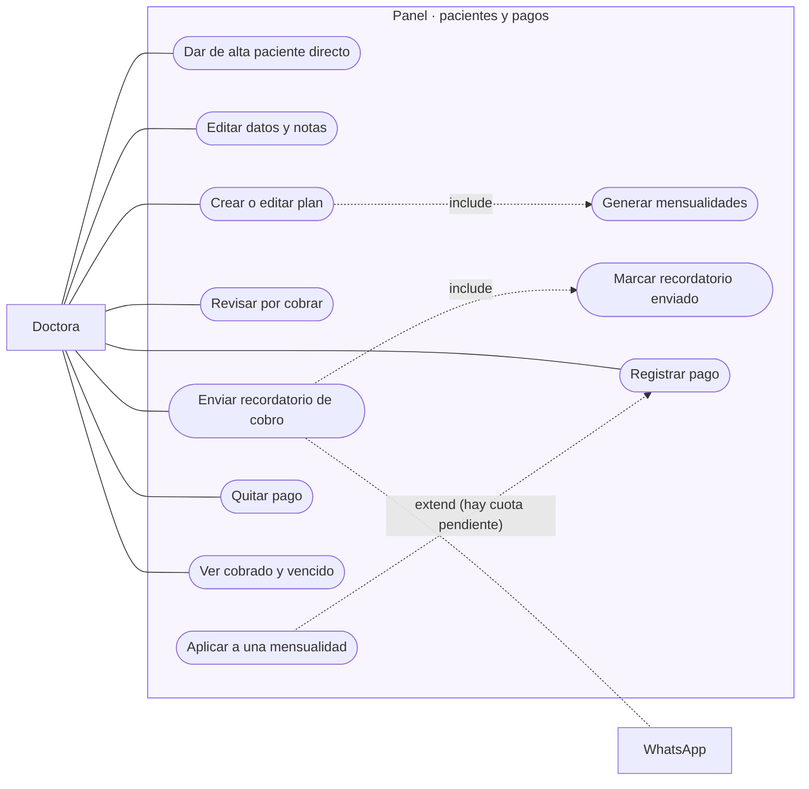
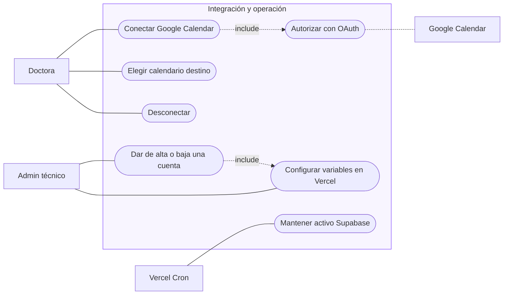

# 2 · Casos de uso

Mermaid no tiene diagrama de casos de uso, así que aquí se dibujan con `flowchart`, con esta equivalencia con la notación UML:

| UML | Aquí |
|---|---|
| Actor | Rectángulo fuera del sistema |
| Caso de uso | Óvalo (`([…])`) dentro del sistema |
| Límite del sistema | `subgraph` |
| Asociación | Línea continua |
| «include» / «extend» | Flecha punteada con la etiqueta |

En el tablero de FigJam se dibujan con figuras de actor y elipses.

## Actores

| Actor | Tipo | Quién es |
|---|---|---|
| Visitante | Humano, externo | Persona que entra a la landing (posible paciente) |
| Doctora | Humano, rol `doctora` | Acceso total al panel |
| Recepcionista | Humano, rol `recepcionista` | Prospectos, seguimiento y agenda; sin pacientes ni dinero |
| Admin técnico | Humano, fuera del panel | Da de alta cuentas con `pnpm admin` y configura Vercel |
| Google Calendar | Sistema externo | Recibe la copia de las citas |
| WhatsApp | Sistema externo | Abre la conversación con el mensaje ya escrito (`wa.me`) |
| Vercel Cron | Temporizador | Llama al keepalive todos los días |

## CU-00 · Vista general

## CU-01 · Sitio público

## CU-02 · Acceso al panel

## CU-03 · Captación de prospectos

## CU-04 · Agenda

## CU-05 · Pacientes y cobranza (solo doctora)

## CU-06 · Integración y operación

## Especificación breve de los casos principales

| Caso | Precondición | Flujo principal | Postcondición | Alternos |
|---|---|---|---|---|
| Solicitar valoración | Formulario hidratado | Llena datos → acepta aviso → envía → `POST /api/contact` | Fila en `solicitudes` con estado `nueva` | 422 (datos), 429 (límite), 502 (base), honeypot (200 sin guardar) |
| Iniciar sesión | Cuenta en `ADMIN_EMAILS` y en `admins` | Correo y contraseña → Supabase Auth → cookies → `/admin` | Sesión con rol | Credenciales o correo no permitido: mismo mensaje |
| Contactar por WhatsApp | Prospecto con teléfono | Toca WhatsApp → vuelve → «Marcar como contactada» | Estado `contactada` y acción `whatsapp` | «Ahora no»: sin cambios |
| Agendar cita | Rol con agenda | Quién → cuándo (fecha, tipo, duración) → Guardar | Cita `programada`; si viene de prospecto: `agendada` y acción `cita_creada` | Datos inválidos: se conserva lo tecleado; Google falla: `error` |
| Convertir en paciente | Doctora; prospecto sin ficha | Revisar datos → Crear paciente | Ficha creada; solicitud `terminado`; seguimiento cerrado; acción `conversion` | Ya convertida: redirige a la ficha |
| Registrar pago | Doctora; paciente existente | Paciente → a qué aplica → monto → método y fecha → Guardar | Fila en `pagos`; saldo y estado de cuota recalculados por las vistas | Monto inválido o sin paciente: error en pantalla |
| Enviar recordatorio | Cuota vencida o parcial | WhatsApp con mensaje de cobro → Marcar enviado | Fila en `recordatorios_cobro` | — |
| Conectar Google | Doctora; credenciales en el servidor | Conectar → consentimiento → callback → elegir calendario | Tokens cifrados y `calendario_id` guardados | `state` inválido, cancelado o fallo de intercambio |
