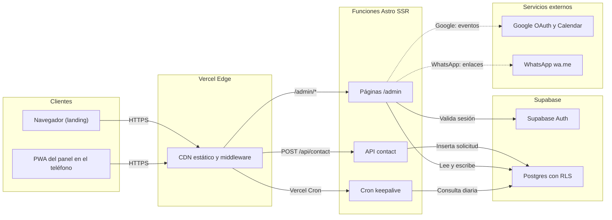
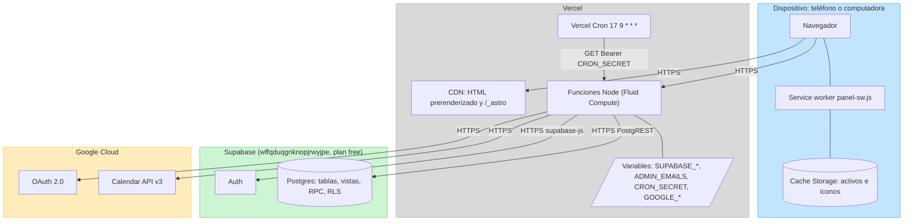
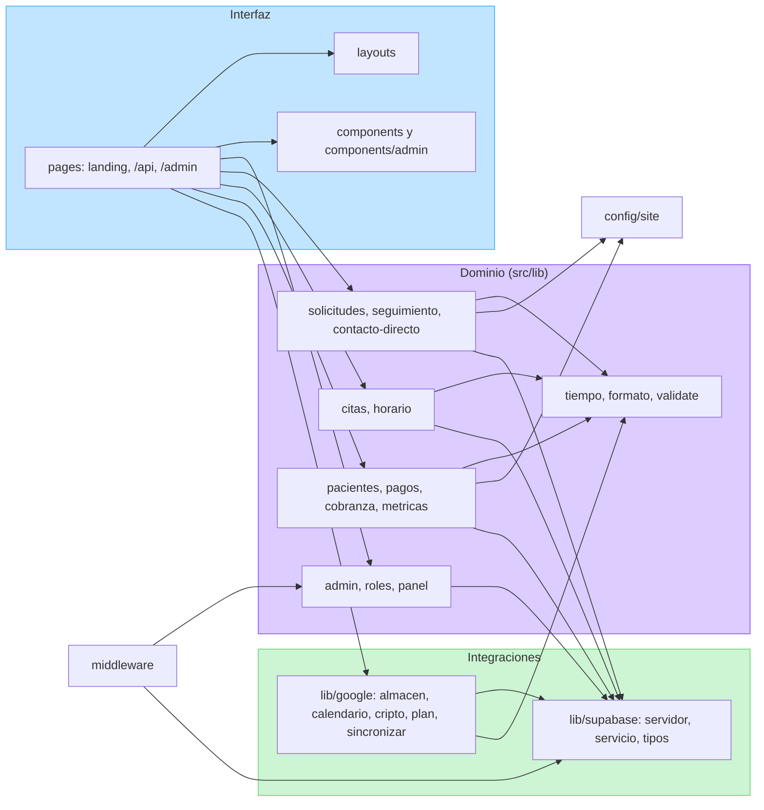
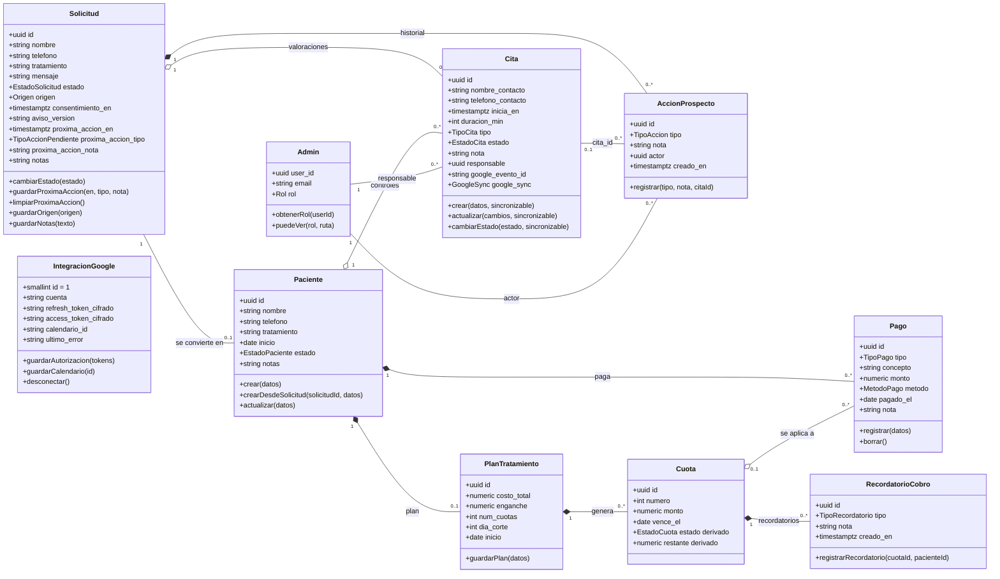
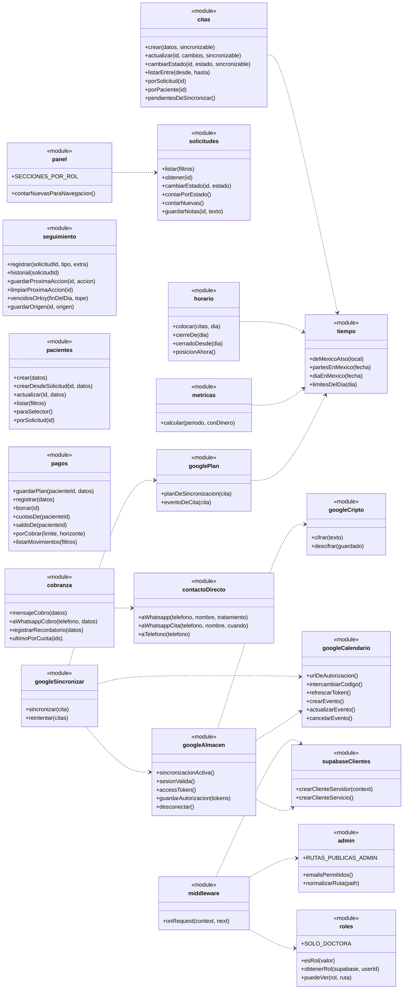
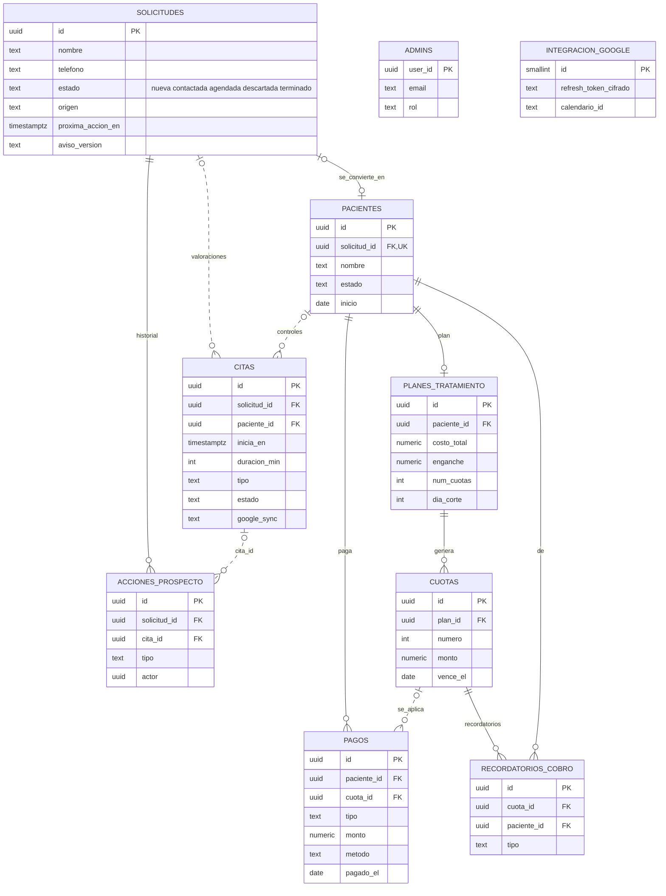
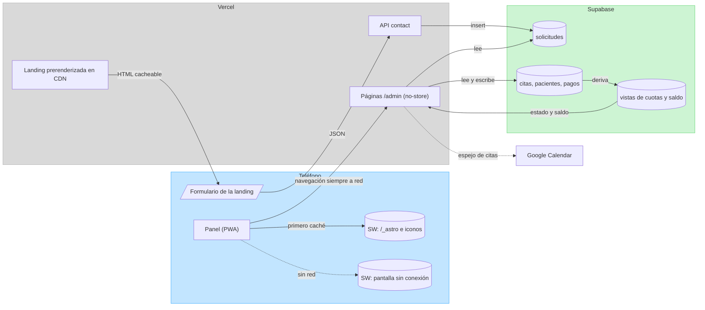

# 3 · Estructura

## E-01 · Diagrama de componentes

Qué piezas se despliegan y cómo se hablan.

| Componente | Tecnología | Responsabilidad |
|---|---|---|
| CDN y middleware | Vercel + `src/middleware.ts` | Sirve la landing prerenderizada; en `/admin` valida sesión, allowlist y rol; pone `no-store` y `noindex` |
| API contact | `src/pages/api/contact.ts` | Recibe el formulario, aplica límite y validación, inserta con la clave de servicio |
| Páginas /admin | Astro SSR (`prerender = false`) | Pantallas del panel; escrituras con formularios POST → 303 |
| Cron keepalive | `src/pages/api/cron/keepalive.ts` | Consulta diaria para que el proyecto free no se pause |
| Supabase Auth | Supabase | Correo y contraseña; cookies de sesión |
| Postgres con RLS | Supabase | Tablas, vistas, RPC y políticas por rol |
| Google OAuth y Calendar | Google Cloud | Autorización de la doctora y espejo de citas |
| WhatsApp | `wa.me` | Abre la conversación con el texto preparado; no hay API |

## E-02 · Diagrama de despliegue

## E-03 · Diagrama de paquetes

Dependencias reales entre carpetas (imports), de la interfaz hacia los datos.

## E-04 · Diagrama de clases del dominio

Las tablas como clases, con sus operaciones del dominio (funciones de `src/lib` que las modifican).

Enumeraciones:

| Enum | Valores |
|---|---|
| EstadoSolicitud | nueva, contactada, agendada, descartada, terminado |
| Origen | sitio, instagram, recomendacion, otro |
| TipoAccionPendiente | whatsapp, llamada, cita, otro |
| TipoAccion | whatsapp, llamada, cita_creada, cita_reprogramada, cita_cancelada, conversion, nota |
| TipoCita | valoracion, control |
| EstadoCita | programada, confirmada, atendida, cancelada, no_asistio |
| GoogleSync | pendiente, sincronizada, error, desactivada |
| EstadoPaciente | activo, retencion, alta, pausado |
| EstadoCuota (derivado) | pendiente, parcial, pagada, vencida |
| TipoPago | mensualidad, enganche, cargo_suelto |
| MetodoPago | efectivo, transferencia, tarjeta |
| TipoRecordatorio | whatsapp, llamada |
| Rol | doctora, recepcionista |

Composición (`*--`): la parte se borra con el todo (`ON DELETE CASCADE`). Agregación (`o--`): sobrevive (`ON DELETE SET NULL`). Eso explica H-17: al rehacer el plan, las cuotas se borran en cascada y los pagos, que son agregación, quedan sin cuota.

## E-05 · Módulos de servicio (`src/lib`)

Cada módulo como una clase estática: sus funciones exportadas y de quién depende.

## E-06 · Modelo entidad-relación

Vistas derivadas: `vista_cuotas` (estado y restante de cada cuota) y `vista_saldo_paciente` (pagado, saldo, cuotas y monto vencido). RPC: `crear_plan_con_cuotas`.

## E-07 · Contratos de API y acciones de formulario

Todas las escrituras del panel son formularios `POST` con `accion=…` que responden `303` a un `GET` (patrón PRG). Astro rechaza un `POST` sin cabecera `Origin` válida (`security.checkOrigin`).

| Método y ruta | Entrada | Validación | Respuestas | Efecto |
|---|---|---|---|---|
| `POST /api/contact` | JSON: nombre, telefono, tratamiento, mensaje, consentimiento, empresa (honeypot) | Límite 5 cada 10 min por IP; `validate()`: nombre ≤ 120, teléfono con 7 dígitos o más, tratamiento de la lista, mensaje ≤ 2000, consentimiento | `200 {ok}` · `400` JSON mal formado · `422 {errores}` · `429` · `502` | Inserta en `solicitudes` con `aviso_version` |
| `GET /api/cron/keepalive` | `Authorization: Bearer CRON_SECRET` | Comparación en tiempo constante | `200 {ok, total, nuevas}` · `401` · `500` | Solo lecturas |
| `POST /admin/auth/entrar` | email, password | Correo en `ADMIN_EMAILS` antes de llamar a Auth | `303 /admin` · `303 /admin/login?error=credenciales` | Cookies de sesión |
| `POST /admin/auth/salir` | — | — | `303 /admin/login?salir=1` | `signOut({scope: 'global'})` |
| `GET /admin/integracion/google/conectar` | — | Credenciales presentes | `303` a Google (cookie `state`, 10 min) · `303 ?error=sin-credenciales` | — |
| `GET /admin/integracion/google/callback` | code, state | `state` igual a la cookie | `303 ?conectado=1` · `303 ?error=estado`, `cancelado`, `sin-codigo` o `conexion` | Tokens cifrados en `integracion_google` |
| `POST /admin/integracion/google` | `accion=calendario` (calendario) · `desconectar` · `sincronizar` | id de calendario no vacío | `303 ?guardado=1` · `303 ?error=calendario` o `guardar` | Calendario, borrado de tokens o reintento |
| `GET /admin/agenda/ocupacion` | `dia=AAAA-MM-DD` | Formato de fecha | `200 {ocupado[]}` · `400` · `502` | Solo lectura (franja de nueva cita) |
| `POST /admin` (Inicio) | `accion=seguimiento-hecho` + id · o id + estado | Estado válido y distinto de `terminado` | `303` a la misma URL (**errores silenciosos**, H-08) | Cierra seguimiento o cambia estado (+ acción whatsapp) |
| `POST /admin/prospectos` | id, estado | Igual que arriba | `303` a la misma URL (silencioso, H-08) | Cambia estado |
| `POST /admin/prospectos/[id]` | `accion=estado` · `notas` · `origen` · `seguimiento` (cuando, tipo, nota) · `seguimiento-hecho` · `seguimiento-quitar` · `llamada` | Estado, origen, fecha y tipo válidos | `303 ?guardado=1` (con `&pendiente=1` si queda seguimiento) · `303 ?error=estado`, `origen`, `seguimiento` o `guardar` | Solicitud y `acciones_prospecto` |
| `POST /admin/prospectos/[id]/convertir` | nombre, telefono, tratamiento, inicio, estado, notas | Nombre y estado válidos; `UNIQUE solicitud_id` | `303 /admin/pacientes/[id]?creado=1` · `200` con error en pantalla | Paciente, solicitud `terminado`, acción `conversion` |
| `POST /admin/agenda` | `accion=estado` (id, estado) · `sincronizar` | Estado de cita válido | `303` misma vista `?guardado=1` · `?error=1` | Cita y, si se cancela, acción `cita_cancelada` |
| `POST /admin/agenda/nueva` | `?solicitud` o `?paciente`; nombre, telefono, inicia_en, tipo, duracion_min, nota | Nombre, fecha, duración de 5 a 480, tipo válido | `303 /admin/agenda?dia&cita&guardado=1` · `200` con error y datos conservados | Cita; prospecto `agendada`; acción `cita_creada`; Google |
| `POST /admin/agenda/[id]` | `accion=reprogramar` (inicia_en, duracion_min, tipo, nombre, telefono, nota) · `estado` | Fecha, duración y tipo válidos | `303 ?guardado=1` · `303 ?error=datos` o `guardar` · `404` | Cita, acciones y Google |
| `POST /admin/pacientes/nuevo` | nombre, telefono, tratamiento, inicio, estado, notas, `?volver` | Nombre y estado válidos; `volver` solo ruta local | `303 volver?paciente=id` · `303 /admin/pacientes/[id]?creado=1` · `200` con error | Paciente |
| `POST /admin/pacientes/[id]` | `accion=datos` · `notas` · `recordatorio` (cuota) | Nombre y estado válidos | `303 ?guardado=1` · `303 ?recordatorio=1#mensualidades` · `303 ?error=…` | Paciente o recordatorio |
| `POST /admin/pacientes/[id]/plan` | tratamiento, costo_total, enganche, num_cuotas, dia_corte, inicio | Costo mayor que 0; 0 ≤ enganche ≤ costo; 0 a 120 cuotas; corte de 1 a 28 | `303 /admin/pacientes/[id]?plan=1` · `200` con error | RPC `crear_plan_con_cuotas` (borra y rehace, H-17) |
| `POST /admin/pagos` | `accion=recordatorio` (id, paciente) · borrar (id) | — | `303` a la misma URL (silencioso, H-08) | Recordatorio o borrado de pago |
| `POST /admin/pagos/nuevo` | paciente_id, aplica (`cuota:<id>`, mensualidad, enganche o cargo_suelto), monto, metodo, pagado_el, concepto, nota | Paciente; monto mayor que 0; tipo y método válidos | `303 /admin/pacientes/[id]?pago=1` · `200` con error (**pierde lo tecleado**, H-09) | Pago |
| Middleware (cualquier `/admin/*`) | Cookies | Sesión, allowlist, rol, `puedeVer` | `302 /admin/login` · `303 /admin?acceso=denegado` (GET) · `403` (POST) | `signOut` si la sesión no está autorizada |

## E-08 · Flujo de datos y caché

| Qué | Dónde se cachea | Por qué |
|---|---|---|
| Landing (HTML, imágenes) | CDN de Vercel | Pública y prerenderizada |
| `/_astro/*` (JS y CSS con hash) | Cache Storage del teléfono, primero caché | Inmutables por el hash en el nombre |
| Iconos, manifest, favicon | Cache Storage, stale-while-revalidate | Cambian poco |
| HTML de `/admin` | **Nunca** (`private, no-store`; el SW siempre va a la red) | Contiene datos de pacientes |
| Pantalla sin conexión | Cache Storage, se instala con el SW | Respuesta a una navegación sin red |
