# 4 · Actividad

Diagramas de actividad UML dibujados como `flowchart`. Los rombos son decisiones, los óvalos inicio y fin, y los `subgraph` son carriles por actor o capa.

## A-01 · Recorrido completo: de la solicitud al cobro

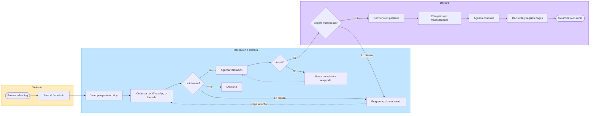

## A-02 · Envío del formulario (`POST /api/contact`)

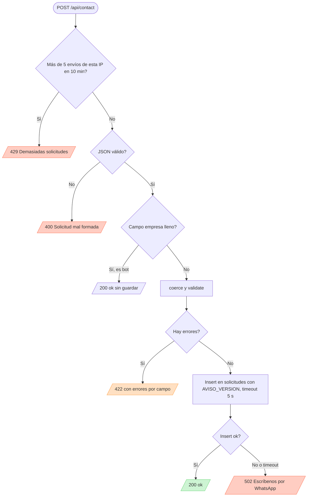

## A-03 · Barreras del middleware en `/admin/*`

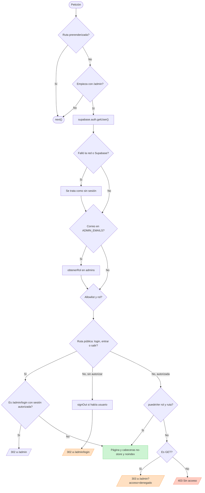

## A-04 · Cola «Hoy» de Inicio

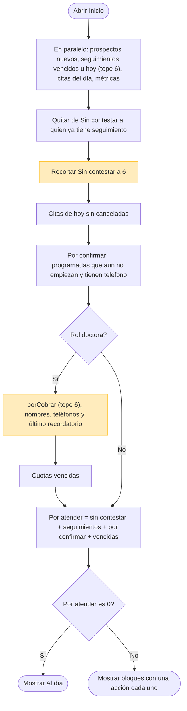

Los dos pasos en amarillo recortan a 6 **antes** de contar, por eso el total puede quedarse corto (H-07).

## A-05 · Agendar una cita

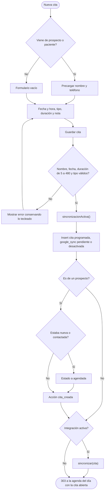

No hay comprobación de empalmes ni de horario (H-10).

## A-06 · Asistencia y conversión

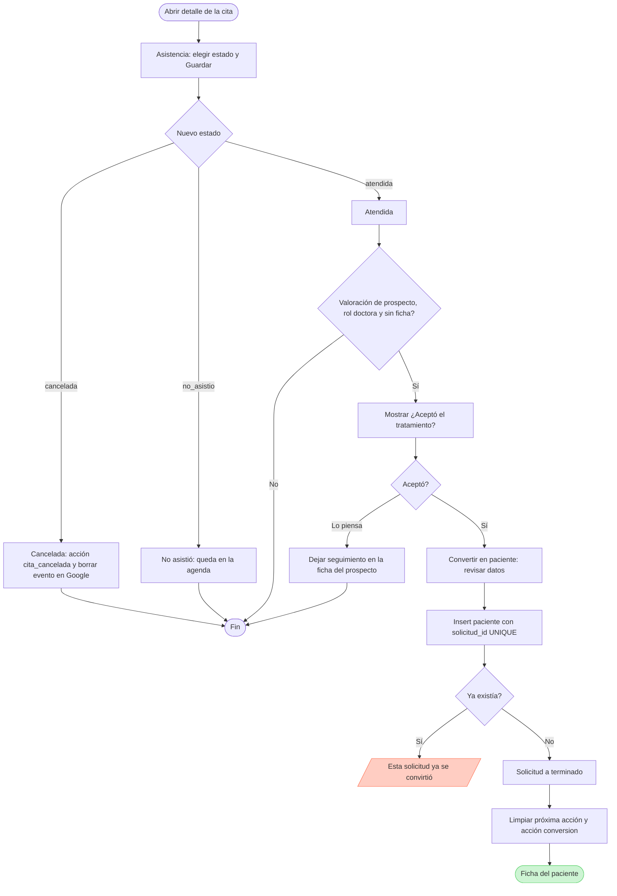

Crear el paciente y pasar la solicitud a *terminado* son dos escrituras separadas (H-15).

## A-07 · Registrar un pago

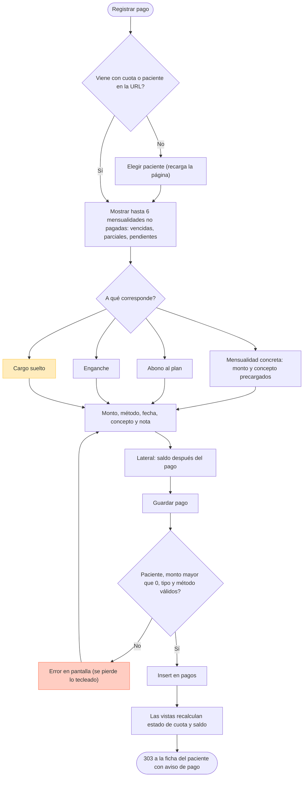

El cargo suelto resta del saldo del plan (H-18) y un error de validación pierde lo tecleado (H-09).

## A-08 · Cobranza de una cuota vencida

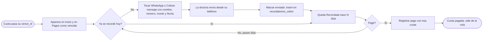

## A-09 · Sincronización de una cita con Google

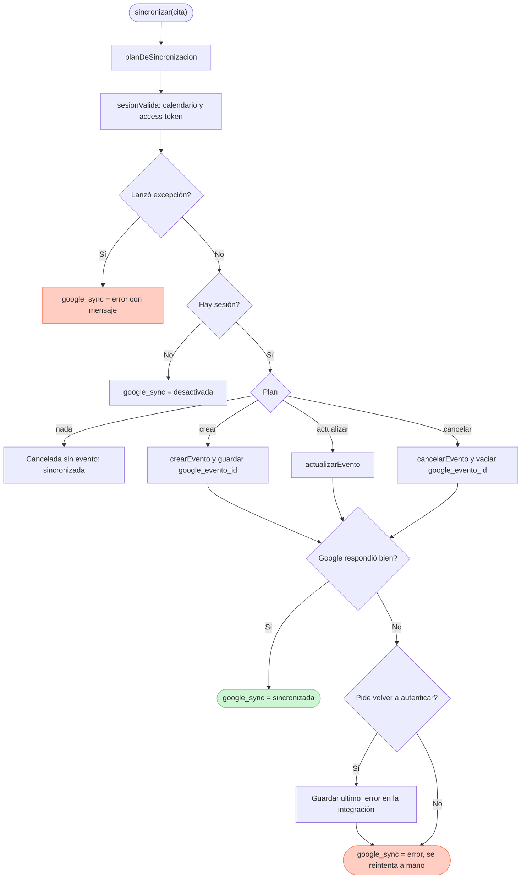

## A-10 · Service worker del panel

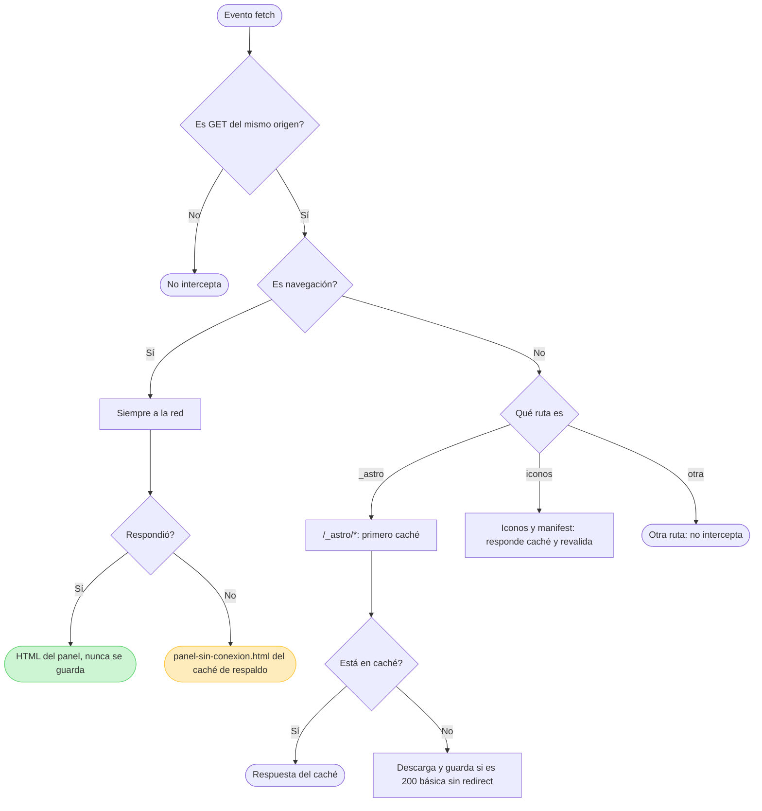

## A-11 · Cron keepalive

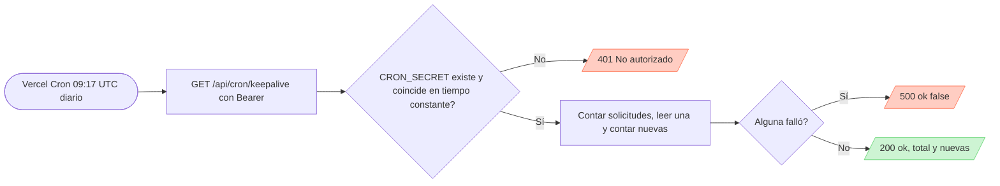

## A-12 · Manejo de errores y degradación

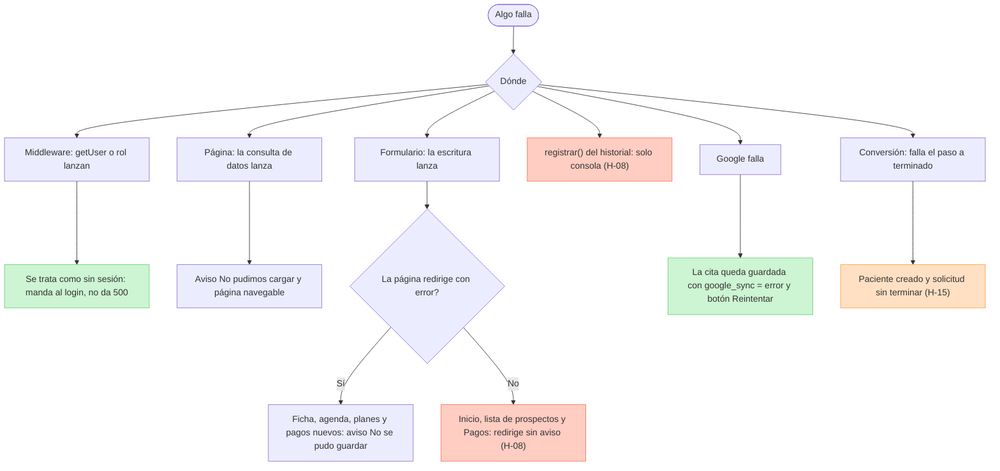
