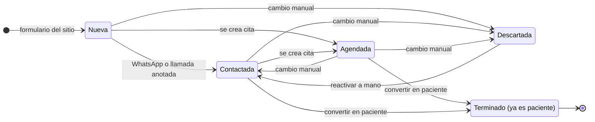
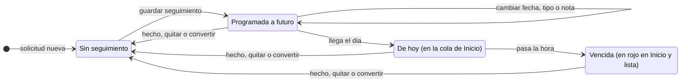
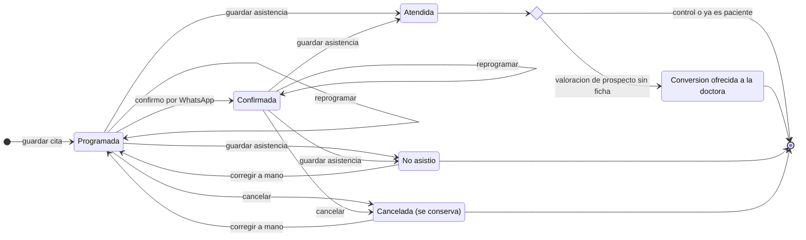
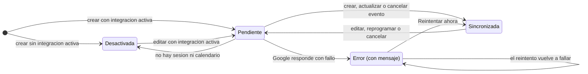
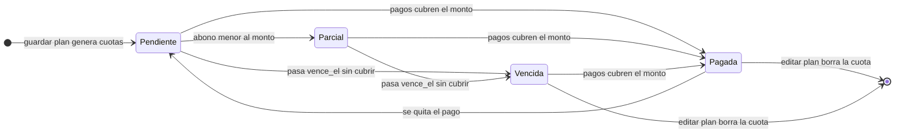
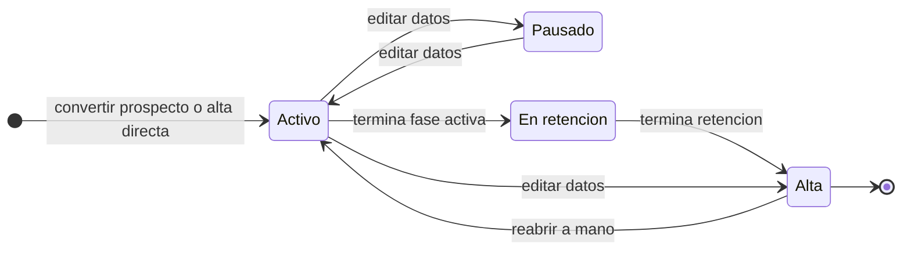
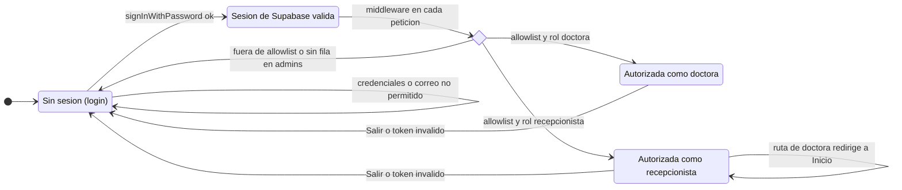
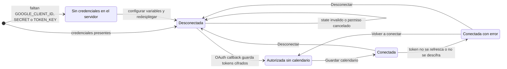

# 5 · Estados

Máquinas de estados UML de cada entidad con ciclo de vida. Los nombres coinciden con los `ETIQUETA_*` de `src/lib/supabase/tipos.ts` y con los `check` de las migraciones.

## S-01 · Solicitud (prospecto)

- El selector de la ficha permite cualquier estado salvo `terminado` (`ESTADOS_MANUALES`).
- Agendar solo mueve a *agendada* desde *nueva* o *contactada*: un descartado que vuelve no reaparece como nuevo.
- Marcar *contactada* desde la ficha no anota contacto (H-04).

## S-02 · Próxima acción (seguimiento)

*De hoy* y *Vencida* no se guardan: se derivan de `proxima_accion_en` contra la hora actual.

## S-03 · Cita

## S-04 · Sincronización Google de una cita

## S-05 · Cuota (estado derivado)

Precedencia en `vista_cuotas`: `pagada` › `vencida` › `parcial` › `pendiente`. La fecha se compara con `current_date` en UTC (H-12), y editar el plan borra las cuotas (H-17).

## S-06 · Paciente (estado del tratamiento)

El formulario deja elegir el estado inicial y cualquier cambio posterior; el diagrama muestra el uso esperado.

## S-07 · Sesión y acceso

## S-08 · Integración con Google Calendar

