# 6 · Secuencia

Mensajes en orden temporal. Flecha continua = petición; punteada = respuesta. `Postgres` es Supabase vía PostgREST con el cliente de la usuaria, sujeto a RLS, salvo donde se indica «clave de servicio».

## Q-01 · Solicitar valoración

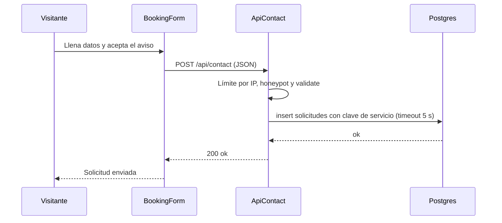

## Q-02 · Iniciar sesión

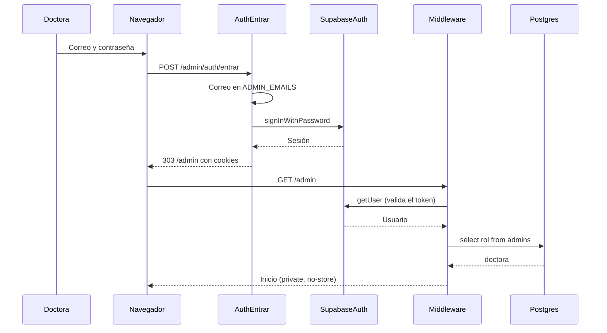

## Q-03 · Agendar desde un prospecto, con Google

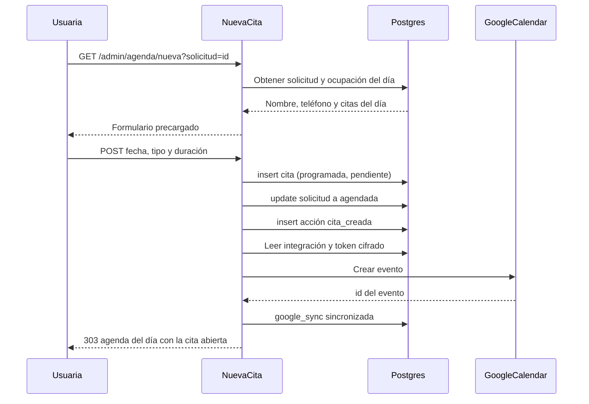

## Q-04 · Convertir en paciente

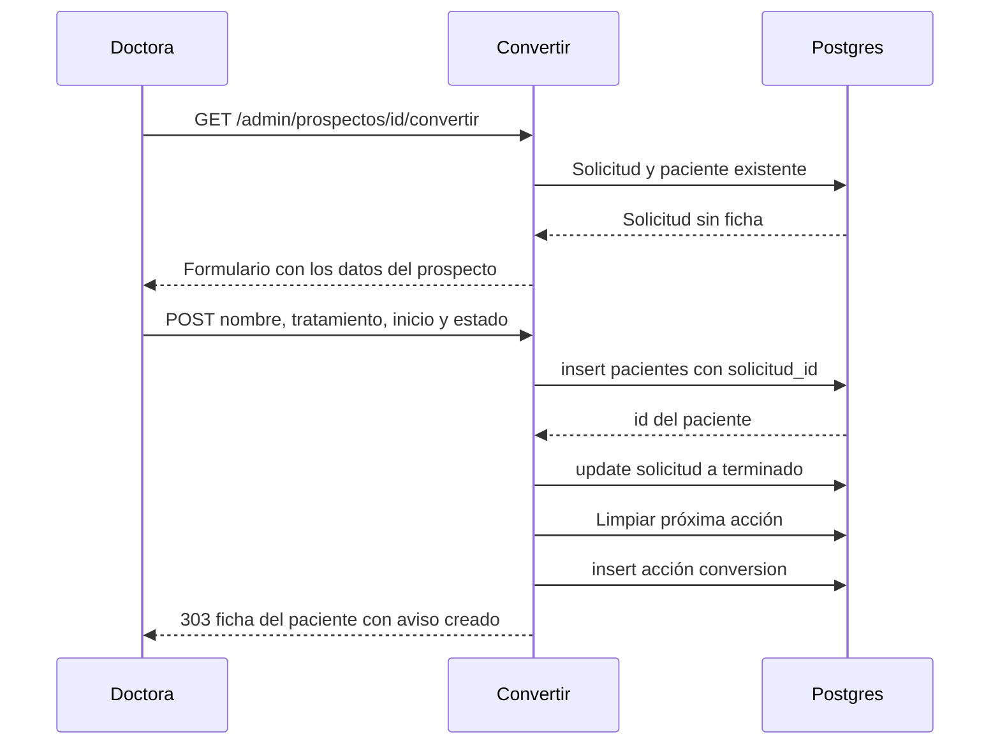

## Q-05 · Crear o editar el plan

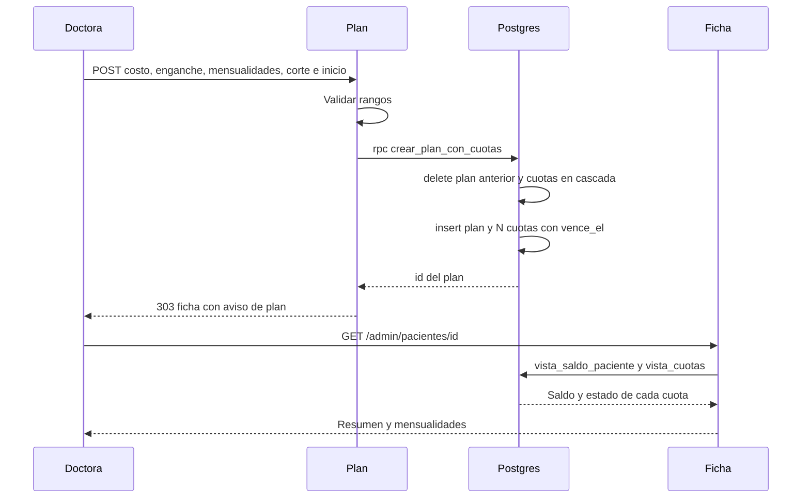

## Q-06 · Registrar pago

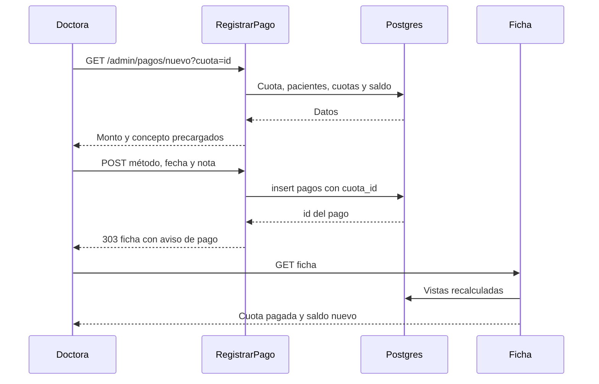

## Q-07 · Recordatorio de cobro

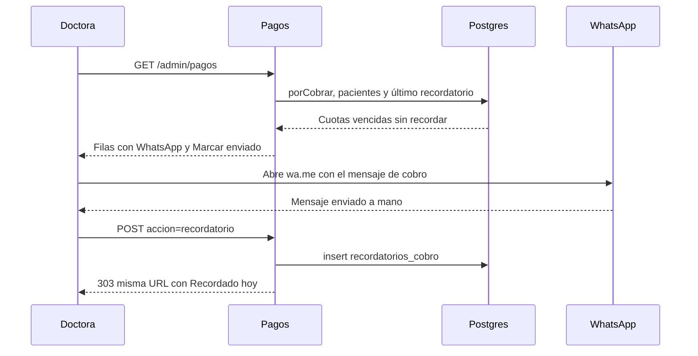

## Q-08 · Conectar Google Calendar

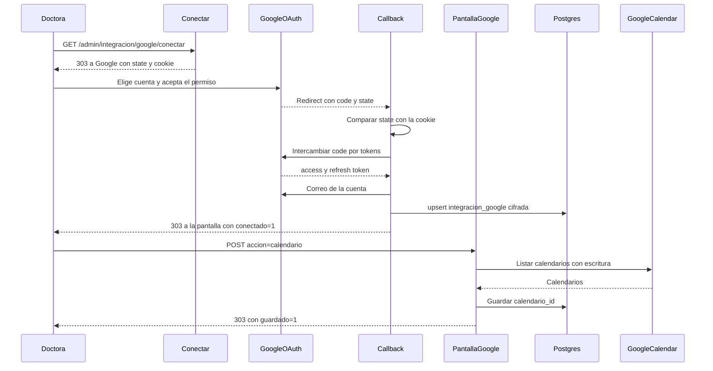

## Q-09 · Reintentar la sincronización

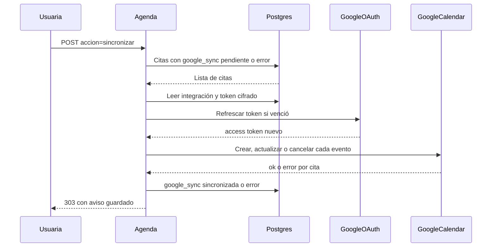

## Q-10 · Cron keepalive

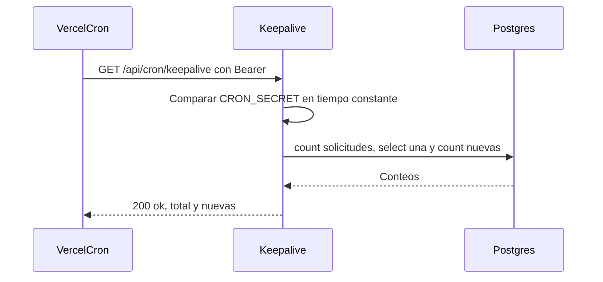

## Q-11 · Contactar desde la cola y aviso al volver

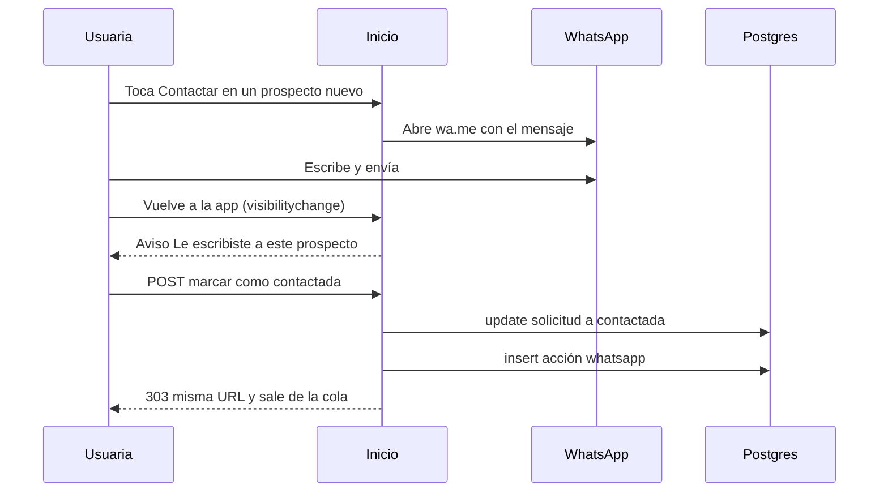
